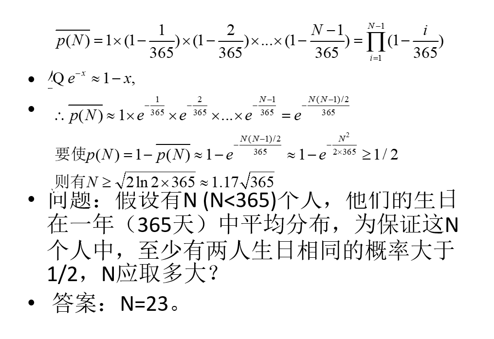

# md4Collision

Assignments for Course of Hash

Reference a lot from Xiaoyun Wang's paper.

Coding in a pretty graceful style.

view `md4.cpp` for details.

## Review Outline

- hash函数定义
- hash函数满足的安全属性：抗碰撞攻击，抗源象攻击，抗第二源象攻击 is what
- hash函数的生日攻击是指什么，复杂度证明
- md4碰撞路线的推导，会写出保证路线成立的充分条件
- 会基本的消息修改

## Review

Hash函数H将可变长度的数据块M作为输入，产生固定长度的Hash值h = H(M)。

称M是h的原像。因为H是多对一的映射，所以对于任意给定的Hash值h，对应有多个原像。

如果满足x≠y且H(x)=H(y)，则称为碰撞

[生日碰撞](http://www.cnblogs.com/elpsycongroo/p/7687409.html)

